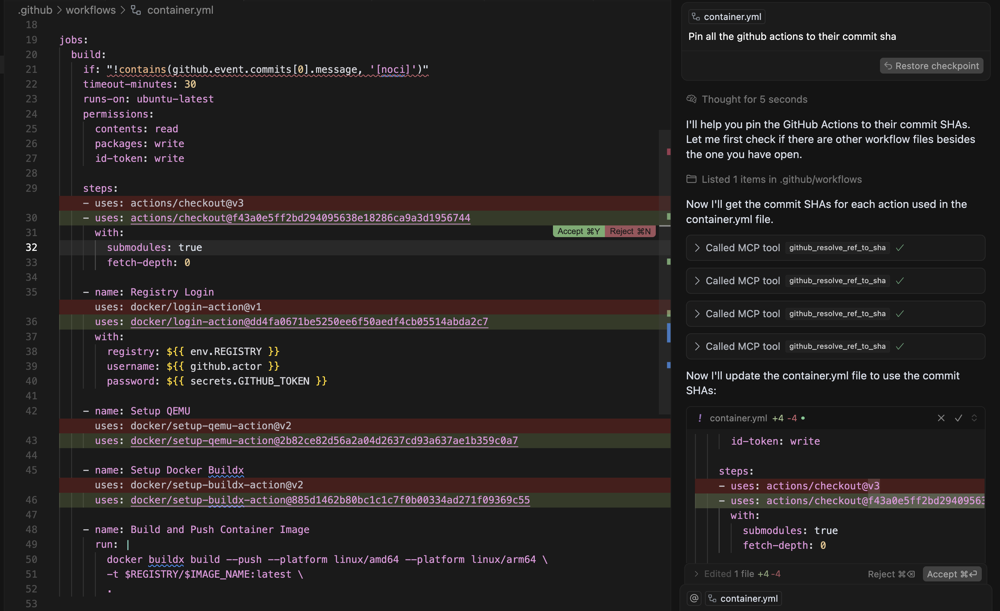

# Pinner MCP 📍

A Model Context Protocol (MCP) server that can help pin 3rd party dependencies to immutable digests.
Supported dependency types include:

- Docker base images
- GitHub Actions



## 📦 Usage

Run as a container with `stdio` transport.

```bash
docker run -it --rm ghcr.io/safedep/pinner-mcp:latest
```

### 💻 Cursor

Add the following to your `.cursor/mcp.json` file. You must *enable*
the MCP server in the settings. Learn more [here](https://docs.cursor.com/context/model-context-protocol#what-is-mcp).

```json
{
  "mcpServers": {
    "pinner-mcp-stdio-server": {
      "command": "docker",
      "args": [
        "run",
        "--rm",
        "-i",
        "safedep/pinner-mcp:latest"
      ]
    }
  }
}
```

Use a Composer prompt like the following to pin a specific commit hash.

```
Pin GitHub Actions to their commit hash.
```

```
Pin container base images to digests.
```

### 🔄 Updates

Updates are automatically pushed to the `latest` tag on
[GitHub Container Registry](https://github.com/safedep/pinner-mcp/pkgs/container/pinner-mcp). You
must manually update your local container image to the latest version.

```bash
docker pull ghcr.io/safedep/pinner-mcp:latest
```

## 📚 References

- Originally built to protect [vet](https://github.com/safedep/vet) from malicious GitHub Actions
- [mcp-go](https://github.com/mark3labs/mcp-go) is a great library for building MCP servers
- Built and maintained by [SafeDep Engineering](https://safedep.io)